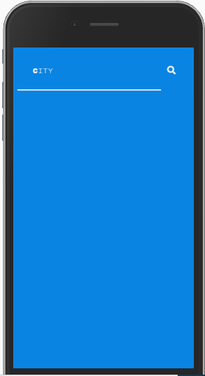

# Whether App
wheter app based  on  external API . display temperature for city you choose  it in a way that looks nice on your phone .

## Table Of Contents
- [Whether App](#Whether-App)
  * [Running the project](#running-the-project)
  * [Screenshots](#Screenshots)
    + [search](#search)
    + [add city](#add-city)
    + [saved cities](#saved-cities)
  * [Tech-Stack](#Techstack)
  * [TODO](#todo)

## Running the project

1. Clone the repo
2. Run npm install
3. Run node server.js from the root directory.
4. Navigate to http://localhost:3001

## Screenshots

### search
Search for a city in the world you want to know its temperature 

### add city
Save the cities names, so that the next time you enter in to the app, it will show you the city you saved.

### saved cities
Upon re-entering the app, it will show you all the saved cities and the option to remove them from the list 

## Techstack
1. Jquery,oop,handlebars,mvc.
2. Express (Node.js),mongoose,axios.

## TODO
1. Current Location- On page load,  show the weather for the user's current location.
2. Last updated-display the time that the weather data was last updated.
3. Refresh button- Add a button to each of the city's weather while rendering , update city data.

